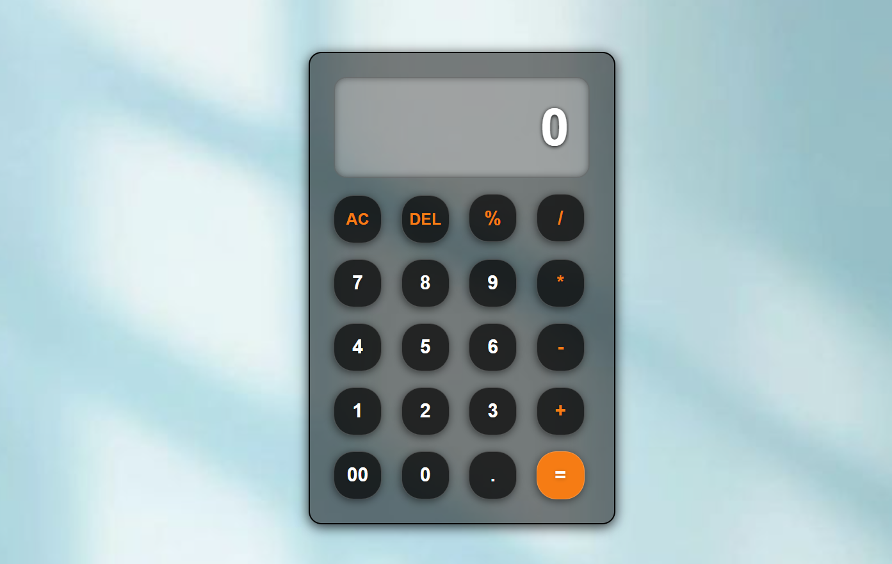

# 🧮 Simple Calculator

  
 
 <b>A modern and responsive calculator built with pure front-end technologies</b> 

## 🚀 Tech Stack

  

## ✨ Features
- Perform basic arithmetic operations  
- Responsive and clean UI  
- Fast and lightweight  
- Interactive button-based input  
- Clear/reset functionality  

## 🌐 Live Demo

👉 https://thilini28.github.io/Calculator/

## 📸 Preview

  

## ⚙️ Installation
1. git clone https://github.com/thilini28/calculator.git
2. cd calculator
3. start `index.html`

## 🧠 How It Works
- Uses DOM manipulation to capture button clicks
- Applies JavaScript logic to perform calculations
- Dynamically updates the display in real-time

## 🚀 Future Improvements

- 🕘 History Tracking
- 🌙 Dark mode
- ➗ Advanced operations
- 🎨 UI animations
  
## ⭐ Support

If you like this project, give it a ⭐ on GitHub — it helps a lot!

## 📊 Project Status

## Status: Completed ✅
